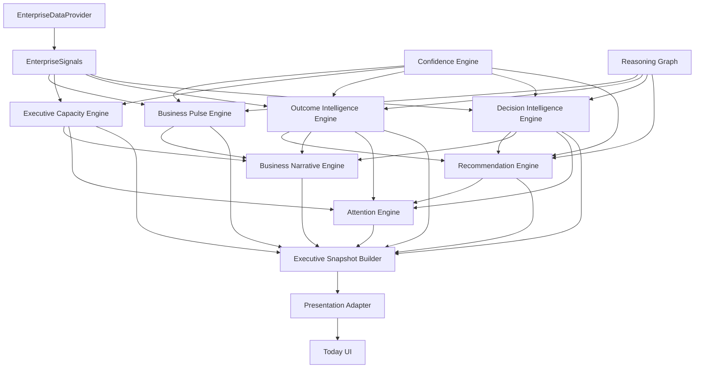
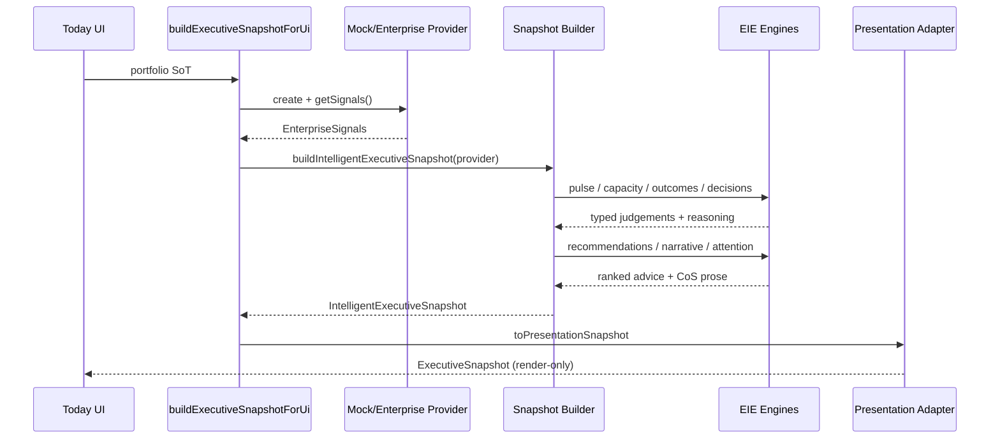

# Executive Intelligence Engine — Architecture

## Responsibility split

```
Enterprise Systems          Intelligence Layer              Presentation
─────────────────          ─────────────────              ────────────
Salesforce ─┐
M365 / Teams┤              ┌─────────────────────┐
Outlook ────┤  signals     │ Executive           │  snapshot
Jira ───────┼─────────────►│ Intelligence Engine │─────────► Today UI
ServiceNow ─┤              │ (pure functions)    │          Decisions UI
SAP / Oracle┤              └─────────────────────┘          Outcomes UI
Snowflake ──┘                       │
Mock Portfolio ─────────────────────┘
```

The UI never derives business meaning.  
The Intelligence Engine never knows the source system.

Above this layer, the **Executive Judgement Engine** structures options, trade-offs, and unknowns — it does not bind Decisions.

## Module map



## Sequence — building Today



## Engine contracts

### 1. Business Pulse
Inputs: outcome momentum, decision backlog, strategic risk, workload, volatility, confidence.  
Output: `PulseResult` with state, factors, narrative, reasoning graph.  
Rule: never average health scores into a state label.

### 2. Executive Capacity
Inputs: meetings, decisions, approvals, initiatives, context switching.  
Output: capacity, attention budget, leadership load, remaining units.

### 3. Outcome Intelligence
Each Outcome → trajectory, momentum, evidence, systems, prediction, recommendation.

### 4. Decision Intelligence
Ranks by `executiveImportance` (urgency × impact × linkage), not by calendar date.

### 5. Recommendation
Every act includes reason, evidence, benefit, downside, confidence, related Outcomes.

### 6. Business Narrative
CoS tone. Summaries interpret overnight change. No status theatre.

### 7. Attention
Budget in minutes. Items compete. Only winners appear on Today.

### 8. Confidence
Completeness, freshness, agreement, history, prediction, AI — with ceilings.

### 9. Reasoning Graph
Answers Why / What changed / Evidence / Systems for every judgement.

### 10. Snapshot Builder
Single orchestration point → `IntelligentExecutiveSnapshot`.

## Decade-ready extension

1. Keep `EnterpriseDataProvider` as the only integration surface.
2. Add connectors that normalise into `EnterpriseSignals`.
3. Engines remain unchanged.
4. Presentation adapters may evolve per surface without touching reasoning.
