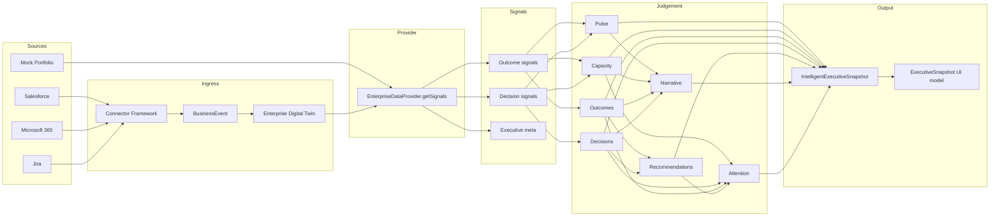

# Executive Intelligence Engine — Data Flow

## Signal → Judgement → Presentation



## Explainability path

For any Today value:

1. Find the entity id (Decision, Outcome, Recommendation, or `pulse`)
2. Read `intelligent.reasoningIndex[id]`
3. Surface:
   - `question`
   - `whatChanged`
   - `evidence[]`
   - `systems[]`
   - `summary`

```ts
import { runExecutiveIntelligence, explainGraph } from "@/intelligence/executive-intelligence";

const intelligent = runExecutiveIntelligence(portfolio);
const graph = intelligent.reasoningIndex["decision-residency"];
console.log(explainGraph(graph));
```

## Replacing mock providers

| Step | Change |
|------|--------|
| 1 | Implement `EnterpriseDataProvider` for the connector |
| 2 | Map native payloads → `EnterpriseSignals` |
| 3 | Pass provider into `buildIntelligentExecutiveSnapshot(provider)` |
| 4 | No engine edits required |

## Determinism

Engines are pure functions of `EnterpriseSignals`.  
No clocks, randomness, or network calls inside engines.  
Freshness uses signal timestamps / assumed operating-window hours supplied by the provider mapping layer.
