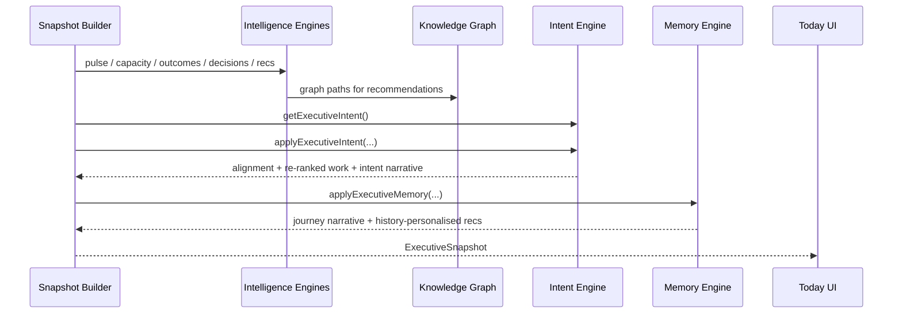

# Executive Intent Engine — Architecture

## Stack position

```
Enterprise Signals → Executive Intelligence Engine (business)
                              │
Organisational Graph ─────────┤
                              │
Executive Intent Engine ──────┤
         (the executive)      │
                              │
Executive Memory Engine ──────┴─► IntelligentExecutiveSnapshot → Today UI
         (the journey)
```

Independently replaceable via `ExecutiveIntentProvider`.

## Sequence



## Ranking formula

```
attentionPriority = businessImportance × 0.55 + intentScore × 0.45
(+ high-alignment boost / conflict penalty)
```

Today no longer ranks by business importance alone.

## Narrative shift

| Before | After |
|--------|-------|
| What happened overnight | What happened that affects YOUR priorities |
| Generic portfolio summary | Priority lens + highest-alignment call |

## Provider swap

```ts
createMockExecutiveIntentProvider("CEO")

// Future: Workday goals, Lattice, Cascading OKRs, Notion strategy docs
createGoalsSystemIntentProvider(config)
```
