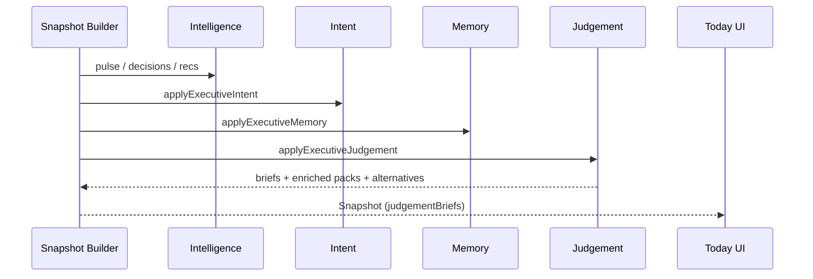

# Executive Judgement Engine — Architecture

## Stack position

```
Connectors → Twin → Knowledge Graph
                      │
Enterprise Signals ───┤
                      ▼
           Executive Intelligence Engine
                      │
           Executive Intent Engine
                      │
           Executive Memory Engine
                      │
           Executive Judgement Engine  ← structures thinking
                      │
                      ▼
           IntelligentExecutiveSnapshot (incl. judgementBriefs)
```

## Sequence



## Stance vs Decision

EJE may emit a **stance** (`lean_approve`, `lean_investigate`, …).  
A stance is a structured leaning for comparison — **not** a bind.

## Invariants

1. Alternatives presented whenever the catalogue has them
2. Unknowns always non-empty
3. Trade-offs always expose costs with gains
4. Closing note reminds: humans decide
