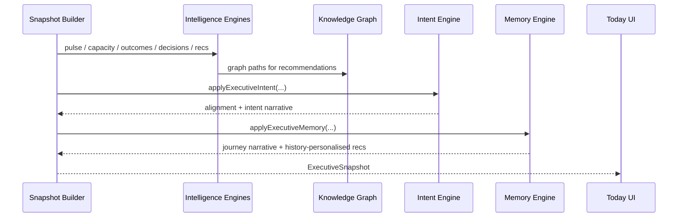

# Executive Memory Engine — Architecture

## Stack position

```
Enterprise Signals → Executive Intelligence Engine (business)
                              │
Organisational Graph ─────────┤
                              │
Executive Intent Engine ──────┤
                              │
Executive Memory Engine ──────┴─► IntelligentExecutiveSnapshot → Today UI
         (the journey)
```

Independently replaceable via `ExecutiveMemoryProvider`.

## Sequence



## Memory timeline

Every entity can accumulate history through `entityTimeline(store, entityId)`:

Decision · Outcome · Risk · Recommendation · Action · Meeting · Strategic Initiative · Commitment · Behaviour

## Drift model

```
strategicDriftScore ← attentionDrift + intent–behaviour gap + consistency pressure
leadershipConsistency ← decision velocity + delegation + focus
executionQuality ← deep work + meeting load + approval latency
attentionDrift ← inverse of strategic_focus behaviour score
```

Intent priorities raise the gap when behaviour contradicts them (e.g. Helix recurrence while ARR is top priority).

## Provider swap

```ts
createMockExecutiveMemoryProvider()

// Future
createSupabaseExecutiveMemoryProvider(client)
```

## Self-review invariants

1. ExecutiveOS improves every week because it remembers
2. Recommendations become more personalised over time
3. No historical insight is invented
4. Every insight cites `evidenceEventIds`
