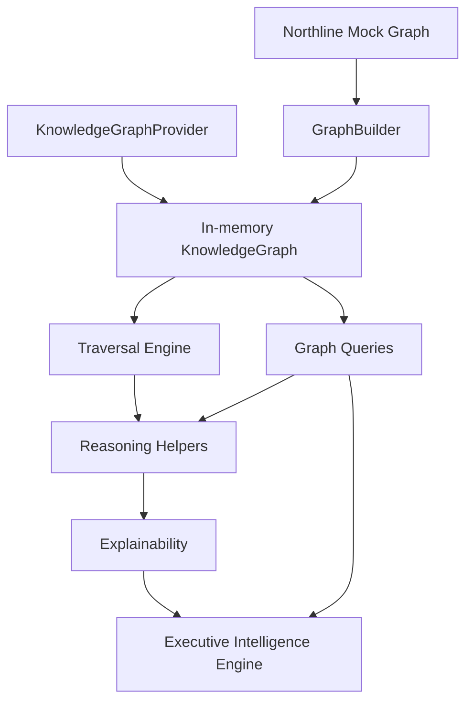
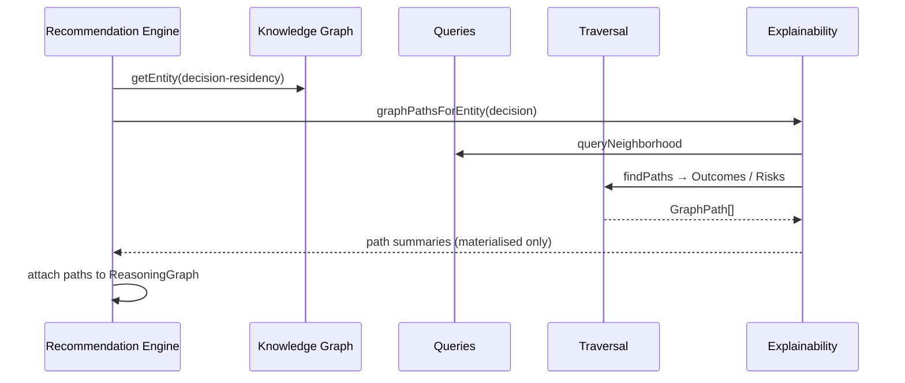

# Executive Knowledge Graph — Architecture

## Position in the stack

```
Connectors → BusinessEvent → Digital Twin → Knowledge Graph → Executive Intelligence
```

```
Enterprise Systems → Signal Providers → Executive Intelligence Engine
                                              ▲
                                              │ traverses
                                    Executive Knowledge Graph
                                    (organisational relationships)
```

The Intelligence Engine interprets Twin-backed signals.  
The Knowledge Graph models the organisation those signals belong to.  
`updateKnowledgeGraphFromTwin` keeps the graph aligned after each sync.

## Module map



## Sequence — explain a recommendation



## In-memory → Neo4j

| Concern | Today | Future |
|---------|-------|--------|
| Storage | `KnowledgeGraph` Map adjacency | Neo4j bolt driver |
| Load | `GraphBuilder` / mock fixture | Cypher import from `GraphSnapshot` |
| Query | TypeScript traversals | Cypher + same API facade |
| Contract | `KnowledgeGraphProvider` | unchanged |

`GraphSnapshot` is the portable interchange format.

## Rules

1. Never invent edges during explainability.
2. Multi-hop discovery uses traversal over materialised relationships only.
3. Entity ids for Outcomes/Decisions align with portfolio SoT where possible.
4. No React. No UI.
